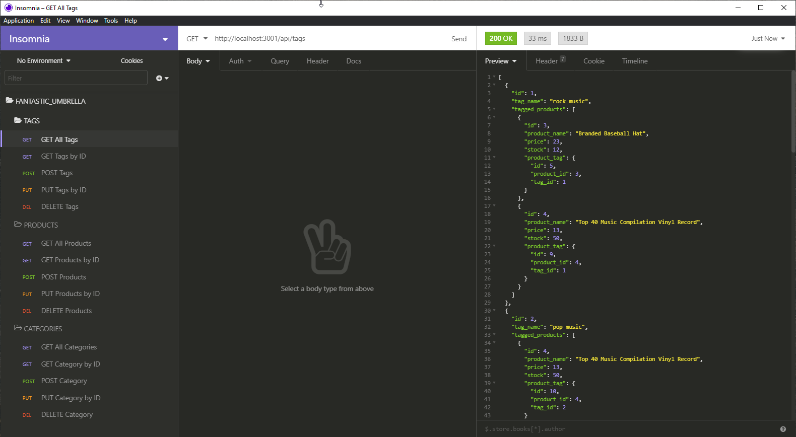

# Fantastic Umbrella

## Description

Internet retail, also known as e-commerce, is the largest sector of the electronics industry, having generated an estimated US$29 trillion in 2017 (Source: United Nations Conference on Trade and Development). E-commerce platforms like Shopify and WooCommerce provide a suite of services to businesses of all sizes. Due to the prevalence of these platforms, developers should understand the fundamental architecture of e-commerce sites.

This is a build for the back end for an e-commerce site. I used a a working Express.js API and configure it to use Sequelize to interact with a MySQL database.

## Deployed

This is a local back-end, please follow the install instructions to use!

### Table of Contents

- [NPM](#npm)
- [User Story](#user)
- [Install](#initialize)
- [Contributing](#contributing)
- [Questions](#questions)
- [About](#about)
- [Screenshot](#screenshot)

## User Story

```md
AS A manager at an internet retail company
I WANT a back end for my e-commerce website that uses the latest technologies
SO THAT my company can compete with other e-commerce companies
```

## NPM Packages

- express.js https://www.npmjs.com/package/express
- bcrypt https://www.npmjs.com/package/bcrypt
- mysql2 https://www.npmjs.com/package/mysql2
- sequelize https://www.npmjs.com/package/sequelize

## Initialize Application

1. Clone the repo.
2. To install the npm packages and make edits to the code, run "npm install express sequelize mysql2 bcrypt" in your termial. You can install multiple libraries using npm by putting a space between each libraries name. If you would just like to test it out, run "npm install".
3. Create a .env file with the following syntax...

```md
DB_NAME='ecommerce_db'
DB_USER='your_username'
DB_PW='your_msqlpwd'
```

4. Log into your MySQL shell and create the db by running 'source db/schema.sql'
5. After you create the db, you can exit and run "npm run seed" in your terminal to seed the db with data.
6. Start the app with "npm start" and use the Insomnia Core (preferable) to test the routes.

## Contributing

Nathan Potts

## Questions

Thanks for looking at my Note Taker Applicaion, my name is Jake Nystrom! If you would like to reach me, feel free to write to jwm.nystrom@gmail.com. I will look forward to hearing from you!

## About the Author

Today, as a motivated and goal oriented individual I embrace challenges, strive to help others learn and develop, work collaboratively with teams, and push myself to further develop my current skill set with an expectation to succeed. I thrive in high paced environments where teams are setup for success.

## Screenshot


